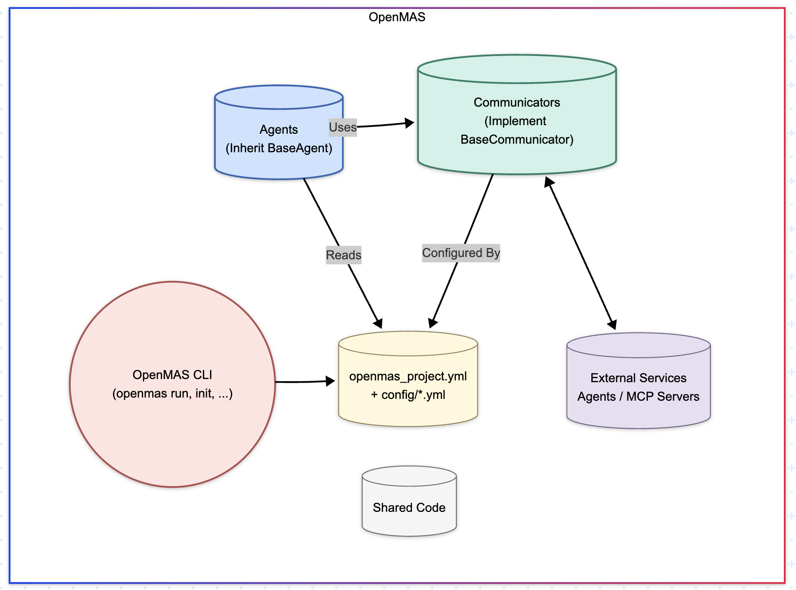

# OpenMAS Architecture

OpenMAS is designed with a modular and extensible architecture to simplify the creation, deployment, and management of Multi-Agent Systems (MAS). This document outlines the core components and how they interact.

## Core Philosophy Recap

Before diving into components, remember the core principles:

* **Simplicity & Composability:** Use simple, understandable building blocks.
* **Modularity & Pluggability:** Easily extend with new communication methods, agent patterns, or tools.
* **Separation of Concerns:** Isolate agent logic, communication, configuration, and deployment.
* **Agent Reasoning Agnosticism:** The framework provides the agent's structure and interaction capabilities, not its internal decision-making logic.
* **Developer Experience:** Streamline common tasks with clear conventions and helpful tooling.

(See the full [Design Philosophy](design.md) for more details).

## High-Level Architecture Overview

The architecture revolves around distinct agents running within a defined project structure, leveraging shared communication and configuration mechanisms, and managed by developer-friendly tooling.

## Key Components

### 1. `BaseAgent` (`openmas.agent.BaseAgent`)

This is the fundamental building block for any active entity within an OpenMAS system. All custom agents inherit from `BaseAgent`.

* **Responsibilities:**
    * Manages the agent's lifecycle (`setup`, `run`, `shutdown`).
    * Handles configuration loading (`self.config`).
    * Instantiates and holds a reference to the agent's communicator (`self.communicator`).
    * Provides standard utilities like logging (`self.logger`).
    * Acts as the container for the agent's specific logic and state.
* **Lifecycle Methods:** Defines standard asynchronous methods developers override:
    * `async setup()`: For initialization, loading resources, registering communication handlers. Called once on start.
    * `async run()`: The main execution logic/loop of the agent. Called after `setup()` completes.
    * `async shutdown()`: For cleanup (e.g., closing connections, saving state). Called once on graceful stop.
* **Instantiation:** Agents are typically discovered and instantiated by the `openmas run` command based on the project configuration, or manually in custom scripts.

### 2. `BaseCommunicator` (`openmas.communication.base.BaseCommunicator`)

This abstract base class defines the interface for all communication methods, decoupling agent logic from the specifics of network protocols or interaction mechanisms (like MCP).

* **Responsibilities:**
    * Sending requests to other services/agents and receiving responses (`send_request`).
    * Sending notifications (fire-and-forget messages) (`send_notification`).
    * Registering handlers for incoming requests (`register_handler`).
    * Managing the underlying communication channels (e.g., starting/stopping HTTP servers, managing MCP sessions, connecting to MQTT brokers).
* **Implementations:** OpenMAS provides concrete implementations:
    * `HttpCommunicator`: Standard request/response over HTTP.
    * `McpSseCommunicator`: Client for interacting with MCP servers via Server-Sent Events.
    * `McpStdioCommunicator`: Client for interacting with MCP servers via standard input/output.
    * `GrpcCommunicator`: **Experimental** support for gRPC-based communication (v0.1.0).
    * `MqttCommunicator`: **Experimental** support for MQTT publish/subscribe patterns (v0.1.0).
    * *(Extensibility: Developers can add custom communicators.)*
* **Selection & Instantiation:** The specific communicator for an agent is determined by its configuration (`communicator_type` and `communicator_options` in `openmas_project.yml` or environment-specific config). `BaseAgent` automatically instantiates the configured communicator during its initialization.

### 3. Configuration System (`openmas.config`)

OpenMAS uses a layered configuration system (powered by Pydantic) to manage settings robustly.

* **Sources:** Loads settings hierarchically from environment variables, `.env` files, the main project YAML (`openmas_project.yml`), and environment-specific YAML files (`config/*.yml`). Later sources override earlier ones.
* **Loading:** The `load_config()` function uses Pydantic models (like `AgentConfig` or custom subclasses) for validation and type-safe access.
* **Access:** Configuration is validated during agent startup and made available within the agent via `self.config`.

(See the [Configuration Guide](../guides/configuration.md) for details).

### 4. Project Structure & Conventions

OpenMAS promotes (but doesn't strictly enforce) a standard project layout to enhance organization and maintainability.

* `agents/`: Contains subdirectories for each agent's code.
* `config/`: Holds environment-specific configuration files (e.g., `development.yml`, `production.yml`).
* `shared/`: Optional directory for code shared between agents within the project.
* `extensions/`: Optional directory for project-local extensions (e.g., custom communicators).
* `packages/`: Optional directory for vendored external dependencies.
* `openmas_project.yml`: The main project definition file, specifying agents, default configurations, etc.
* `requirements.txt`: Standard Python dependencies.

(See [Project Structure](project_structure.md) for details).

### 5. OpenMAS CLI (`openmas` command)

Provides command-line tools to streamline the development workflow.

* `openmas init`: Initializes a new OpenMAS project structure.
* `openmas run`: Discovers and runs agents defined in the project configuration.
* `openmas validate`: Checks configuration files and project structure.
* `openmas deps`: Manages dependencies specified in `packages/`.
* `openmas generate-dockerfile`: Creates Dockerfiles for deploying agents.
* `openmas generate-compose`: Creates a Docker Compose file for multi-agent deployments.

(See the [CLI Documentation](../cli/index.md) for details).

## How Components Interact

1.  **Initialization:** The `openmas run` command parses `openmas_project.yml`, discovers agent code, loads configuration (from files and environment), and instantiates the specified agents.
2.  **Agent Startup:** For each agent, its `__init__` method is called, which in turn instantiates the configured `BaseCommunicator`. The agent's `start()` method is called, executing `setup()` (where communication handlers are often registered) and then `run()`.
3.  **Communication:** An agent uses its `self.communicator` instance (`send_request` or `send_notification`) to interact with other agents or external services. The communicator handles the protocol-specific details. Incoming messages are routed by the communicator to handlers registered during `setup()`.
4.  **Tool Use (MCP):** If using an MCP communicator, an agent can interact with MCP servers (potentially running as separate processes or external services) to discover and invoke tools or access resources, enabling complex capabilities.

## Positioning in the AI Ecosystem

Understanding where OpenMAS fits relative to other tools can help clarify its purpose:

* **vs. Low-Level Distributed Frameworks (e.g., Ray):**
    * **Ray:** Focuses on general-purpose distributed computing, scaling Python/ML tasks using actors and parallel primitives. It's like a powerful engine.
    * **OpenMAS:** A higher-level *application framework* specifically for structuring, developing, and deploying *Multi-Agent Systems*. It provides MAS-specific abstractions (agents, communicators), conventions, and tooling. It's more like the car's chassis and controls designed for the specific task of building MAS. They *could* be complementary (e.g., an OpenMAS agent using Ray for heavy computation).
* **vs. LLM Orchestration/Agent Frameworks (e.g., LangChain, CrewAI, AutoGen):**
    * **LangChain:** A versatile library primarily focused on composing chains and components for LLM applications, including agent patterns and tool use. Highly flexible.
    * **CrewAI:** Focuses on collaborative agent patterns ("crews") with defined roles and tasks.
    * **AutoGen:** Specializes in orchestrating conversations between multiple agents.
    * **OpenMAS:** Aims to be a more general MAS framework. While supporting LLM integration, its focus is broader, emphasizing the overall *architecture* of systems with multiple independent agents, flexible communication protocols (especially MCP), and an integrated development workflow from project initialization to deployment. Its strong stance on MCP offers a distinct path for standardized tool integration.
* **vs. Tool Protocols (e.g., MCP):**
    * **MCP:** An open *protocol* standardizing how AI agents discover and interact with tools/data sources. It defines *how* communication happens for tool use.
    * **OpenMAS:** An *application framework* that *implements and utilizes* protocols like MCP (alongside others like HTTP, gRPC). It provides the structure (`BaseAgent`) and mechanisms (`McpCommunicator`) to easily build agents that can speak MCP and leverage its ecosystem.

In essence, OpenMAS provides the structured environment and essential services (lifecycle, configuration, communication abstraction, tooling) needed to build, run, and deploy applications composed of multiple interacting agents, with a particular strength in leveraging the standardized MCP for tool integration.
